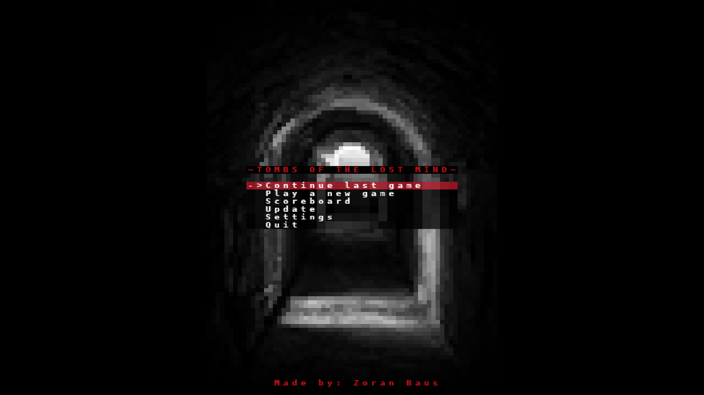
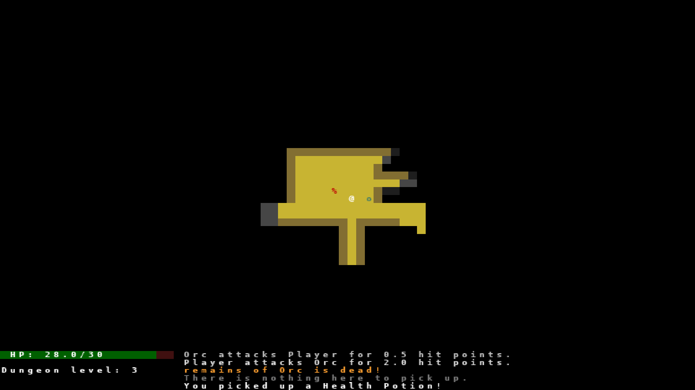

# The Lost Mind

The Lost Mind is a roguelike game built with Python and the `tcod` library.

## Table of Contents

- [About](#about)
- [Installation](#installation)
- [Usage](#usage)
- [Features](#features)
- [Project Structure](#project-structure)
- [Screenshots](#screenshots)
- [Development](#development)
- [Contributing](#contributing)
- [License](#license)
- [Acknowledgements](#acknowledgements)

## About

Welcome to The Lost Mind, a thrilling roguelike 2D dungeon crawler that challenges your wit and reflexes! Dive into a world of mystery and danger as you explore procedurally generated dungeons filled with formidable foes, hidden treasures, and enigmatic secrets.

The Lost Mind is a roguelike game built with Python and the `tcod` library. It offers a unique and immersive gaming experience with its procedurally generated dungeons, strategic turn-based combat, and rich lore. Players can explore the depths of the dungeon, battle various enemies, collect powerful items, and uncover the story behind The Lost Mind.

### Features


- **Random Dungeon Generation**: 
  - Each playthrough generates a new dungeon layout, ensuring a unique experience every time you play. The dungeon is created using procedural generation algorithms, which randomly place rooms, corridors, and various elements within the game world.

- **Turn-Based Combat**: 
  - Engage in strategic turn-based combat with various enemies. Each action, such as moving, attacking, or using an item, takes one turn. Enemies also take their turns, creating a dynamic and tactical combat system where planning and positioning are crucial.

- **Inventory System**: 
  - Manage your items and equipment through an intuitive inventory system. Players can pick up, drop, and use items found throughout the dungeon. The inventory system also allows for equipping weapons and armor to enhance your character's abilities.

- **Leveling System**: 
  - Gain experience points (XP) by defeating enemies and completing objectives. As you accumulate XP, your character will level up, improving their stats and unlocking new abilities. This system provides a sense of progression and growth as you delve deeper into the dungeon.

- **Scoreboard**: 
  - Track your high scores and compare them with others. The game records your achievements and displays them on a scoreboard, allowing you to see how you stack up against other players. This feature adds a competitive element and encourages replayability.

- **Settings**: 
  - Customize controls and other game settings to suit your preferences. The settings menu allows you to adjust various aspects of the game, such as keybindings, audio levels, ensuring a personalized gaming experience.

- **Multiple Enemy Types**: 
  - Encounter a variety of enemies, each with unique behaviors and abilities. From simple creatures to powerful bosses, the diverse enemy types keep the gameplay challenging and engaging.

- **Rich Lore and Story**: 
  - Discover the lore and story behind The Lost Mind as you explore the dungeon. Through in-game texts, dialogues, and environmental storytelling, players can uncover the mysteries and history of the game world.

- **Save and Load System**: 
  - Save your progress and load previous games. The save and load system allows you to continue your adventure from where you left off, providing convenience and flexibility for players.

- **Modding Support**: 
  - Extend the game with custom mods and content. The game is designed with modding in mind, allowing players to create and share their own modifications, such as new levels, items, and enemies.

- **Achievements**: 
  - Unlock achievements for completing various challenges and milestones. The achievement system rewards players for their accomplishments and adds an extra layer of goals to strive for.

- **Visual and Audio Design**: 
  - Enjoy a visually appealing and atmospheric game world, complemented by immersive sound effects and music. The game's art and audio design work together to create a captivating and engaging experience.

The game is designed to be both challenging and rewarding, providing players with a sense of progression and accomplishment as they delve deeper into the dungeon. Whether you are a seasoned roguelike player or new to the genre, The Lost Mind offers an engaging and captivating experience.

Join the adventure and see if you can uncover the secrets of The Lost Mind!

## Installation

1. Clone the repository:
    ```sh
    git clone https://github.com/yourusername/roguelike_game.git
    ```
2. Navigate to the project directory:
    ```sh
    cd roguelike_game
    ```
3. Install the required dependencies:
    ```sh
    pip install -r requirements.txt
    ```

## Usage

To start the game, run the following command:
```sh
python main.py
```

## Project Structure

The project is organized into several directories and files, each serving a specific purpose. Below is an overview of the project structure:

```
.gitignore
assets/
    images/
    manipulator.bat
    music/
components/
    __init__.py
    ai.py
    base_component.py
    constant.py
    consumable.py
    equipment_type.py
    equipment.py
    equippable.py
    fighter.py
    inventory.py
    level.py
    scoreboard.py
core/
    __init__.py
    actions.py
    color.py
    engine.py
    exceptions.py
    input_handlers.py
    message_log.py
    render_functions.py
    render_order.py
    settings.py
    tile_types.py
game/
    __init__.py
    entity_factories.py
    entity.py
    game_map.py
    procgen.py
main.py
README.md
requirements.txt
updates/
```

### Directory and File Descriptions

- **.gitignore**: Specifies files and directories that should be ignored by Git.

- **assets/**: Contains game assets such as images and music.
  - **images/**: Directory for storing image files used in the game.
  - **manipulator.bat**: A batch file for asset manipulation (e.g., converting or resizing images).
  - **music/**: Directory for storing music files used in the game.

- **components/**: Contains various components that define the game's entities and their behaviors.
  - **\_\_init\_\_.py**: Initializes the components module.
  - **ai.py**: Contains AI logic for enemy behavior.
  - **base_component.py**: Defines the base class for all components.
  - **constant.py**: Stores constant values used throughout the game.
  - **consumable.py**: Defines consumable items and their effects.
  - **equipment_type.py**: Defines different types of equipment.
  - **equipment.py**: Manages equipment-related logic.
  - **equippable.py**: Defines equippable items and their properties.
  - **fighter.py**: Manages combat-related logic for entities.
  - **inventory.py**: Manages the player's inventory.
  - **level.py**: Manages the leveling system for the player.
  - **scoreboard.py**: Manages the scoreboard and high scores.

- **core/**: Contains core game logic and functionality.
  - **\_\_init\_\_.py**: Initializes the core module.
  - **actions.py**: Defines actions that can be performed by entities.
  - **color.py**: Manages color definitions used in the game.
  - **engine.py**: The main game engine that runs the game loop.
  - **exceptions.py**: Defines custom exceptions used in the game.
  - **input_handlers.py**: Manages input handling and user interactions.
  - **message_log.py**: Manages the in-game message log.
  - **render_functions.py**: Contains functions for rendering the game.
  - **render_order.py**: Defines the rendering order for entities.
  - **settings.py**: Manages game settings and configurations.
  - **tile_types.py**: Defines different types of tiles used in the game.

- **game/**: Contains game-specific logic and data.
  - **\_\_init\_\_.py**: Initializes the game module.
  - **entity_factories.py**: Contains factory functions for creating game entities.
  - **entity.py**: Defines the base class for all game entities.
  - **game_map.py**: Manages the game map and dungeon generation.
  - **procgen.py**: Contains procedural generation algorithms for creating dungeons.

- **main.py**: The main entry point for the game. This file initializes and starts the game.

- **README.md**: The readme file providing an overview of the project.

- **requirements.txt**: Lists the Python dependencies required to run the game.

- **updates/**: Directory for storing update logs and patch notes.

This structure helps organize the codebase, making it easier to navigate and maintain. Each directory and file has a specific role, contributing to the overall functionality of the game.

## Screenshots




## Development

### Setting Up the Development Environment

1. Ensure you have Python installed.
2. Clone the repository and navigate to the project directory.
3. Install the required dependencies:
    ```sh
    pip install -r requirements.txt
    ```

### Code Style

This project follows the PEP 8 style guide. Please ensure your code is formatted accordingly.

## Contributing

Contributions are welcome! Please fork the repository and submit a pull request.

## License

This project is licensed under the MIT License.